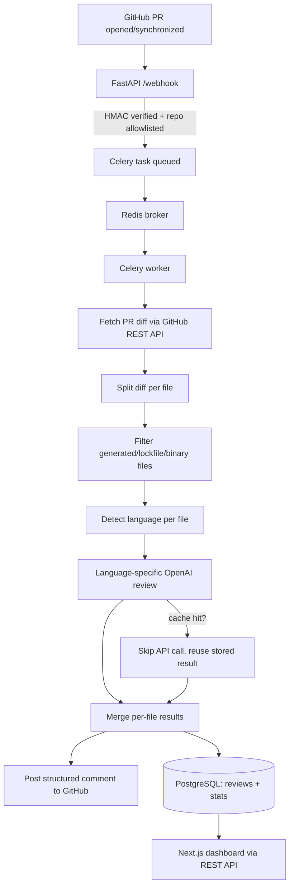

# MergeMind

An asynchronous, idempotent AI code-review pipeline for GitHub Pull Requests — built with FastAPI, Celery, Redis, and PostgreSQL, using OpenAI to catch logic bugs generic prompts typically miss.

## Demo

[Watch the Demo](https://drive.google.com/file/d/1ehzNydCVHrrnP9Spo90DaNCP79a1rFFG/view?usp=sharing)

## Overview

MergeMind listens for GitHub Pull Request events, fetches and splits the diff per file, runs a language-aware AI review on each file, merges the results, and posts a single structured comment back to the PR — while persisting every review to PostgreSQL for a companion dashboard.

## Problem

Manual PR review is slow and inconsistent: reviewers are busy, obvious logic errors slip through, and small PRs wait hours for a first pass. Generic "AI review my code" tools often make this worse, not better — a vague prompt reviewing a function that silently does the wrong thing frequently reports "no issues found," because nothing in the prompt tells the model to verify behavior against intent.

## Solution

MergeMind automates the *first pass* of review — flagging likely bugs, security issues, and suggested fixes within seconds of a PR being opened or updated — while leaving the actual merge decision to a human. It does not auto-merge, and it is not a replacement for a senior reviewer; it's a fast, consistent first filter.

## Key Features

- **Intent-checking prompt** — the model explicitly compares what a function's name/signature implies against what its body does, before scanning for anything else. This catches simple-looking but wrong logic (e.g. a function named `add` that subtracts) that generic "find bugs" prompts miss.
- **Language-aware review checklists** — Python, JavaScript, TypeScript, and Java each get a checklist tuned to that language's real bug patterns (e.g. mutable default arguments in Python, loose equality in JS, `any`-abuse in TypeScript, NPE risk in Java).
- **Per-file diff analysis** — a multi-file PR is split and each file reviewed independently, then merged into one report.
- **Idempotent by diff hash** — each file's diff is SHA-256 hashed; re-processing an unchanged file (e.g. a duplicate webhook, or a PR update that only touched one other file) skips the OpenAI call entirely and reuses the stored result.
- **Duplicate-comment protection** — a hash of the full set of file-diffs in a review batch is tracked separately, so a Celery retry that re-runs the whole task never posts the same GitHub comment twice.
- **Retry with exponential backoff** — transient OpenAI/GitHub failures (timeouts, rate limits, 5xx) are retried automatically via Celery's native retry mechanism, with full status, retry count, and last-error tracking in Postgres. Non-transient failures (e.g. malformed AI output) are not retried.
- **HMAC-verified webhooks + repo allowlist** — only signed requests from GitHub, for explicitly approved repositories, are processed.
- **Dashboard** — a Next.js frontend showing total reviews, per-repo API-call/cache-hit stats, review history, and a detail view per review.

## Architecture



## How It Works

1. A PR is opened, updated, or reopened on an allowlisted GitHub repo.
2. GitHub sends a webhook to `POST /webhook`.
3. The request's `X-Hub-Signature-256` is verified via HMAC-SHA256 before anything else runs.
4. The `action` and repository are validated against an allowlist.
5. A Celery task is queued and the webhook returns immediately (no blocking on AI work).
6. Redis carries the job to a Celery worker process.
7. The worker fetches the PR's unified diff via the GitHub REST API.
8. The diff is split into per-file chunks.
9. Generated files, lockfiles, and known binary/vendor paths are filtered out.
10. Each remaining file is reviewed individually using a language-specific system prompt.
11. Files whose diff hash matches a previously completed review are skipped (cache hit).
12. Per-file JSON results are merged into one report.
13. The merged review is stored in PostgreSQL, along with per-repo API-call/cache-hit stats.
14. A structured comment is posted to the GitHub PR (deduplicated at the batch level).
15. The Next.js dashboard reads review history and stats from the backend's REST API.

## AI Review Pipeline

Each file is reviewed independently: the diff, PR title, and filename are sent to GPT-4o-mini with a system prompt selected by file extension. The prompt instructs the model to (1) check the function's stated intent against its actual behavior, (2) scan for language-specific issue patterns, (3) scan for general issues (null risks, security, performance, dead code), and (4) return strict JSON with per-issue `confidence` and free-text `reasoning`. Per-file results are merged by category, with an averaged overall score.

**Current limitation:** each file is reviewed using only its own diff — the model does not receive the surrounding file, other changed files' full content, or the rest of the repository. This means cross-file logic errors (e.g. a function call that no longer matches a changed signature elsewhere) are unlikely to be caught. This is a known, deliberate scope boundary, not an oversight.

## Tech Stack

| Technology | Role | Why it's used |
|---|---|---|
| Python / FastAPI | Webhook receiver + dashboard API | Async-native, handles concurrent webhooks without blocking |
| Celery + Redis | Background job queue | Decouples slow AI analysis from GitHub's webhook timeout window |
| OpenAI GPT-4o-mini | Diff analysis | Structured JSON output, strong cost-to-quality ratio for this task |
| PostgreSQL + SQLAlchemy | Persistence | Relational schema for reviews/stats, JSON columns for flexible AI output |
| GitHub REST API + Webhooks | Integration | Fetches diffs, posts comments; webhook delivery is signature-verified |
| Next.js + React + TypeScript | Dashboard | Review history, per-repo stats, review detail views |
| Tailwind CSS | Dashboard styling | |
| Docker Compose | Local dev | Reproducible Postgres + Redis without manual setup |

## Project Structure

```
mergemind/
├── backend/
│   ├── main.py              # FastAPI: webhook receiver + dashboard REST API
│   ├── worker.py            # Celery task: fetch, filter, split, review, merge, post
│   ├── openai_client.py     # OpenAI call with intent-checking system prompt
│   ├── language_prompts.py  # Per-language review checklists
│   ├── diff_parser.py       # Splits a unified diff into per-file chunks
│   ├── file_filters.py      # Skips lockfiles/generated/vendor paths
│   ├── idempotency.py       # SHA-256 diff + batch hashing
│   ├── github_client.py     # Diff fetch + comment posting
│   ├── models.py            # SQLAlchemy schema (reviews, comment batches, stats)
│   ├── test_diff_parser.py  # Manual verification script
│   ├── test_prompt.py       # Manual verification script
│   └── requirements.txt
├── frontend/
│   ├── app/page.tsx              # Dashboard overview
│   ├── app/reviews/page.tsx      # Review history list
│   ├── app/reviews/[id]/page.tsx # Review detail
│   ├── app/repos/page.tsx        # Per-repo stats
│   └── components/ui/            # Shared UI components
├── docker-compose.yml        # PostgreSQL + Redis
└── README.md
```

## Screenshots

### 1. Dashboard Overview

*Total reviews, API calls, cache hits, and recent PR reviews at a glance.*

### 2. GitHub Pull Request

*A real PR with multiple changed files, prior to review completion.*

### 3. AI Review Posted on GitHub

*The structured MergeMind comment posted directly on the PR.*

### 4. Review Detail

*Full breakdown: critical bugs, suggested fixes, confidence, and line references.*

### 5. Review History

*Searchable history of every review across connected repos.*

### 6. Deployment Architecture

*Railway services (FastAPI, Celery worker, Postgres, Redis) alongside the Vercel-hosted frontend.*

## Example Review

> **🤖 MergeMind Review** — Overall Score: 7.0/10
>
> **🚨 Critical Bugs**
> `app.py` — Function `divide` does not implement division; the body uses multiplication instead. *(Confidence: High)*
>
> **💡 Suggested Fixes**
> Change `return a * b` to `return a / b`

## Security

- Webhook requests are verified via HMAC-SHA256 against `X-Hub-Signature-256`, using a shared secret — unsigned or forged requests are rejected before any processing.
- Repositories are explicitly allowlisted via an environment variable; PRs from non-allowlisted repos are ignored.
- `OPENAI_API_KEY` and `GITHUB_TOKEN` are read from environment variables only, never committed (`.env` is gitignored).
- The OpenAI client is lazily initialized, so a missing key fails loudly only when a review is attempted, not by crashing the whole service at startup.

## Reliability

- Celery + Redis decouple slow AI analysis from GitHub's webhook response window.
- Transient failures (OpenAI timeouts/rate limits, GitHub 5xx/timeouts) are retried automatically with exponential backoff via Celery's native `self.retry`; non-transient failures (e.g. malformed JSON from the model) are marked failed rather than retried.
- Every review attempt is tracked through an explicit status lifecycle (`pending → processing → retrying → completed/failed`) with retry count and last error persisted.
- Diff-hash caching means repeat processing of unchanged files never re-calls OpenAI.
- A separate batch-hash prevents the same merged comment from being posted twice, even if the underlying Celery task retries.

## Testing

Two manual verification scripts are included (`test_diff_parser.py`, `test_prompt.py`) — run directly and inspected by hand; there is no automated assertion-based test suite or CI pipeline at this time.

## Deployment / Demo Status

MergeMind was deployed and tested end-to-end during development, including a live GitHub webhook pointed at a Railway-hosted backend and a Vercel-hosted dashboard. The continuously running AI backend is currently not maintained as a public service because each review consumes paid OpenAI API credits. The recorded demonstration captures the working end-to-end workflow, and the complete implementation is available in this repository.

## Current Limitations

- The AI reviews each file's diff in isolation — it does not receive the rest of the repository or other files' full content, so cross-file logic errors are unlikely to be caught.
- Diff content is truncated for very large PRs/files, which can reduce review quality on unusually large changes.
- Severity is expressed by issue category (critical/logic/security/performance), not a fine-grained per-issue severity field.
- Supported languages are Python, JavaScript, TypeScript, and Java; other languages fall back to a generic checklist.
- No automated test suite or CI pipeline yet.
- The backend is not continuously deployed (see above).

## Future Improvements

- Repository-aware context retrieval (RAG) so reviews can reference related files, not just the changed diff
- Richer inline, line-level GitHub review comments instead of one summary comment
- Broader language support
- Automated test suite + CI
- Multi-user auth for a real multi-team dashboard

## Learning / Engineering Highlights

- Designed an event-driven, queue-based architecture (webhook → Redis → Celery) specifically to keep GitHub's webhook response fast while slow AI work happens asynchronously.
- Diagnosed a real failure mode in generic LLM prompting (missed logic bugs) and fixed it with an explicit intent-verification step in the prompt — validated against planted bugs, not just assumed.
- Built idempotency at two levels (per-file diff hash, per-batch comment hash) to make retries and duplicate webhooks safe by construction rather than by luck.
- Implemented Celery's native retry mechanism with exponential backoff, scoped only to genuinely transient exceptions — verified via induced failure testing, not just written and assumed correct.
- Connected a persistence layer and REST API to a separately deployed Next.js dashboard, debugging real cross-service issues (CORS, port mismatches, container concurrency limits) along the way.

## Author

Built by **Vanisha** — B.Tech CSE student, exploring full-stack + AI engineering.

## License

MIT — see [LICENSE](./LICENSE).
